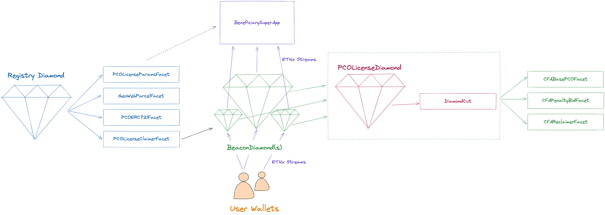
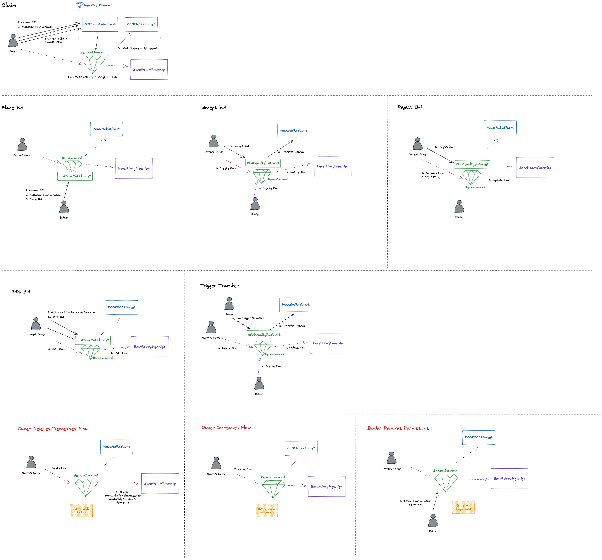

# Geo Web Project

Live at [http://geoweb.land/](http://geoweb.land/)

## Setup

Make sure to make a `.env` file in the root of your project based off the `.env.example` file.

## Deployments

### Optimism (Mainnet)

#### Proxies

| Contract                                                               | Address                                      | Etherscan                                                                           | Louper                                                                                 |
| ---------------------------------------------------------------------- | -------------------------------------------- | ----------------------------------------------------------------------------------- | -------------------------------------------------------------------------------------- |
| [RegistryDiamond](./contracts/registry)                                | `0xba1231785a7b4ac0e8dc9a0403938c2182ce4a4e` | https://optimistic.etherscan.io//address/0xba1231785a7b4ac0e8dc9a0403938c2182ce4a4e | https://louper.dev/diamond/0xba1231785a7b4ac0e8dc9a0403938c2182ce4a4e?network=optimism |
| [PCOLicenseDiamond](./contracts/pco-license)                           | `0xe5769B506e624044ac2d472e76BedBA53Dc2BbEd` | https://optimistic.etherscan.io/address/0xe5769B506e624044ac2d472e76BedBA53Dc2BbEd  | https://louper.dev/diamond/0xe5769B506e624044ac2d472e76BedBA53Dc2BbEd?network=optimism |
| [BeneficiarySuperApp](./contracts/beneficiary/BeneficiarySuperApp.sol) | `0x5aD276439E3772FDb6696B6cB61401902D4e8b72` | https://optimistic.etherscan.io/address/0x5aD276439E3772FDb6696B6cB61401902D4e8b72  |                                                                                        |

#### Facets

| Diamond                                      | Facet                                                                              | Address                                      | Etherscan                                                                           |
| -------------------------------------------- | ---------------------------------------------------------------------------------- | -------------------------------------------- | ----------------------------------------------------------------------------------- |
| [RegistryDiamond](./contracts/registry)      | [GeoWebParcelFacetV2](./contracts/registry/facets/GeoWebParcelFacet.sol)           | `0x53E71045CB4611374e3B28C1A996d25A4397FE45` | https://optimistic.etherscan.io//address/0x53E71045CB4611374e3B28C1A996d25A4397FE45 |
| [RegistryDiamond](./contracts/registry)      | [PCOLicenseClaimerFacetV2](./contracts/registry/facets/PCOLicenseClaimerFacet.sol) | `0x41d77f5A2173ec878F33d88DC5D369f2f29d4954` | https://optimistic.etherscan.io//address/0x41d77f5A2173ec878F33d88DC5D369f2f29d4954 |
| [RegistryDiamond](./contracts/registry)      | [PCOLicenseParamsFacet](./contracts/registry/facets/PCOLicenseParamsFacet.sol)     | `0xCD3cAC9Dd1CE5f2E6cBff6De7a5f4cCB6f8207dd` | https://optimistic.etherscan.io//address/0xCD3cAC9Dd1CE5f2E6cBff6De7a5f4cCB6f8207dd |
| [RegistryDiamond](./contracts/registry)      | [PCOERC721Facet](./contracts/registry/facets/PCOERC721Facet.sol)                   | `0xe8F5c41Fc53ea331A68E45Cdb0ee2f8849EDcaA0` | https://optimistic.etherscan.io//address/0xe8F5c41Fc53ea331A68E45Cdb0ee2f8849EDcaA0 |
| [PCOLicenseDiamond](./contracts/pco-license) | [CFABasePCOFacet](./contracts/pco-license/facets/CFABasePCOFacet.sol)              | `0x845B42DEaB9f007c5a7429606CD01596ead9f77B` | https://optimistic.etherscan.io//address/0x845B42DEaB9f007c5a7429606CD01596ead9f77B |
| [PCOLicenseDiamond](./contracts/pco-license) | [CFAPenaltyBidFacet](./contracts/pco-license/facets/CFAPenaltyBidFacet.sol)        | `0x0E387d23cbCA12954971c44fb22C071dE382fBa6` | https://optimistic.etherscan.io//address/0x0E387d23cbCA12954971c44fb22C071dE382fBa6 |
| [PCOLicenseDiamond](./contracts/pco-license) | [CFAReclaimerFacet](./contracts/pco-license/facets/CFAReclaimerFacet.sol)          | `0x88f2f48A949b21bddB00Fe735ebba79b42f8E261` | https://optimistic.etherscan.io//address/0x88f2f48A949b21bddB00Fe735ebba79b42f8E261 |

### Optimism Goerli (Testnet)

#### Proxies

| Contract                                                               | Address                                      | Etherscan                                                                               |
| ---------------------------------------------------------------------- | -------------------------------------------- | --------------------------------------------------------------------------------------- |
| [RegistryDiamond](./contracts/registry)                                | `0x871C2467D5832226E03853b91Cd00764985EA07C` | https://goerli-optimism.etherscan.io/address/0x871C2467D5832226E03853b91Cd00764985EA07C |
| [PCOLicenseDiamond](./contracts/pco-license)                           | `0x6c09D38c9243493AFb50c22589215A09b37D4e40` | https://goerli-optimism.etherscan.io/address/0x6c09D38c9243493AFb50c22589215A09b37D4e40 |
| [BeneficiarySuperApp](./contracts/beneficiary/BeneficiarySuperApp.sol) | `0xd75b3740E90A397fE4e4FB7D666529623fE183C6` | https://goerli-optimism.etherscan.io/address/0xd75b3740E90A397fE4e4FB7D666529623fE183C6 |

#### Facets

| Diamond                                      | Facet                                                                              | Address                                      | Etherscan                                                                               |
| -------------------------------------------- | ---------------------------------------------------------------------------------- | -------------------------------------------- | --------------------------------------------------------------------------------------- |
| [RegistryDiamond](./contracts/registry)      | [GeoWebParcelFacetV2](./contracts/registry/facets/GeoWebParcelFacet.sol)           | `0x41cb0D0711a55403777b2a3f6eEEbDB8278f0525` | https://goerli-optimism.etherscan.io/address/0x41cb0D0711a55403777b2a3f6eEEbDB8278f0525 |
| [RegistryDiamond](./contracts/registry)      | [PCOLicenseClaimerFacetV2](./contracts/registry/facets/PCOLicenseClaimerFacet.sol) | `0x55Da037A08985f6B2912AEd2917EefF484a804BF` | https://goerli-optimism.etherscan.io/address/0x55Da037A08985f6B2912AEd2917EefF484a804BF |
| [RegistryDiamond](./contracts/registry)      | [PCOLicenseParamsFacet](./contracts/registry/facets/PCOLicenseParamsFacet.sol)     | `0x9cCE213107b9A73efe7f176D016D4d6f58B34804` | https://goerli-optimism.etherscan.io/address/0x9cCE213107b9A73efe7f176D016D4d6f58B34804 |
| [RegistryDiamond](./contracts/registry)      | [PCOERC721Facet](./contracts/registry/facets/PCOERC721Facet.sol)                   | `0xCfD326f3739F4fBECA31FEAd9cC2b0a442d26d57` | https://goerli-optimism.etherscan.io/address/0xCfD326f3739F4fBECA31FEAd9cC2b0a442d26d57 |
| [PCOLicenseDiamond](./contracts/pco-license) | [CFABasePCOFacet](./contracts/pco-license/facets/CFABasePCOFacet.sol)              | `0xf6F2561b8d0c220e104FFde8fa926004c1fd5Aba` | https://goerli-optimism.etherscan.io/address/0xf6F2561b8d0c220e104FFde8fa926004c1fd5Aba |
| [PCOLicenseDiamond](./contracts/pco-license) | [CFAPenaltyBidFacet](./contracts/pco-license/facets/CFAPenaltyBidFacet.sol)        | `0xbC6c7EFAdc7DFe598dc26F7DA2984607a046b11d` | https://goerli-optimism.etherscan.io/address/0xbC6c7EFAdc7DFe598dc26F7DA2984607a046b11d |
| [PCOLicenseDiamond](./contracts/pco-license) | [CFAReclaimerFacet](./contracts/pco-license/facets/CFAReclaimerFacet.sol)          | `0x16E59f52c5f688f9eBd7714e24011757112087e3` | https://goerli-optimism.etherscan.io/address/0x16E59f52c5f688f9eBd7714e24011757112087e3 |

## Architecture

